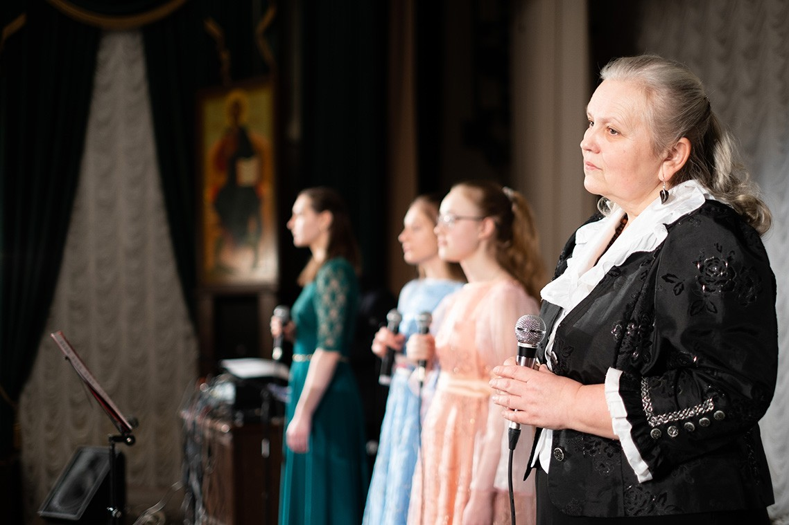
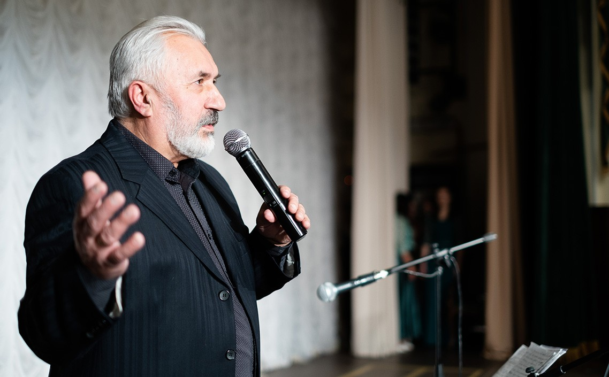
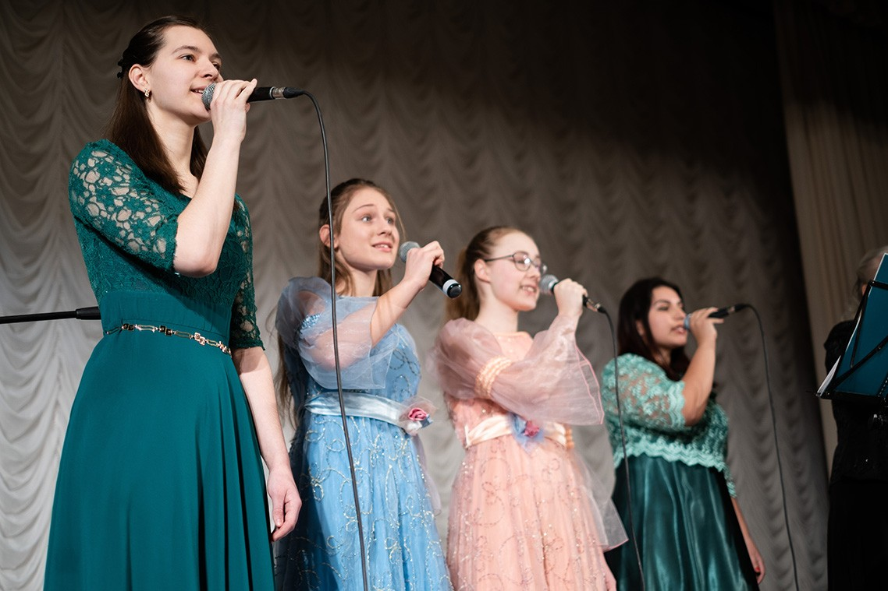

31 января в Большом зале Московской духовной академии прошел концерт под названием «Я вернусь». Перед собравшимися выступили гости из Республики Беларусь — творческая группа «Тимпан». Концерт состоялся при поддержке администрации Московской духовной академии и информационного агентства Белорусской Православной Церкви.

В исполнении коллектива прозвучали композиции «Афон» и «Русская свеча» на стихотворения игумена Виссариона (Остапенко) и монаха Варнавы (Санина). Также прозвучали песни о трагических событиях на Украинской земле. Именно в такие моменты, когда собираются братские народы, понимаешь, что политические взгляды не мешают им быть единым целым. Музыкальная программа завершилась песней на стихи В. Поликаниной «Любить и прощать». 

По окончании концерта с приветствием и словами благодарности за прекрасный вечер к гостям от лица академической семьи обратился архимандрит Венедикт (Князев). 

*— [Источник](https://mpda.ru/news/koncert-ja-vernus-proshel-v-moskovskoj-duhovnoj-akademii/)*